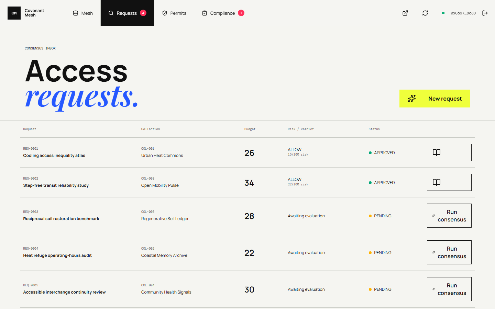

# Covenant Mesh

## A Live Charter for Governed Data Access

> Data permission is not a checkbox. It is a durable relationship between a
> steward, a declared purpose, a bounded method, and an accountable user.

[Open the live mesh](https://madbenofficial.github.io/covenant-mesh/) |
[Inspect the contract](https://explorer-studio.genlayer.com/address/0xF3118770D7D9e75B8D5E31505016105347f18369) |
[Review the source](https://github.com/MadBenOfficial/covenant-mesh)



## Charter Summary

Covenant Mesh is a GenLayer-native coordination protocol for communities and
research organizations that need enforceable rules around collective data.
Stewards publish covenants containing purpose, prohibition, retention,
safeguard, audit, and privacy-budget terms. Researchers submit a bounded method
against a specific collection. GenLayer validators interpret whether that method
fits the covenant and persist a consequential decision on-chain.

The result is not disposable AI commentary. Consensus can create a permit,
allocate a privacy budget, set expiry and audit deadlines, suspend use, revoke
rights, or restore access after remediation.

## Live StudioNet Registry

| Instrument | Public reference |
| --- | --- |
| Network | GenLayer StudioNet, chain `61999` |
| Intelligent Contract | [`0xF3118770D7D9e75B8D5E31505016105347f18369`](https://explorer-studio.genlayer.com/address/0xF3118770D7D9e75B8D5E31505016105347f18369) |
| Deployment transaction | [`0x3ff97d...e9d84dd`](https://explorer-studio.genlayer.com/transactions/0x3ff97dceb7d4b4c0c70f58c13bbca312cbc5e262e495b29215eada6e2e9d84dd) |
| Deployer | `0x659718Bc33FB7CD9f7D111F5270EEbca58e18c3D` |
| GitHub account | [`MadBenOfficial`](https://github.com/MadBenOfficial) |
| Live application | [madbenofficial.github.io/covenant-mesh](https://madbenofficial.github.io/covenant-mesh/) |

The current contract contains real StudioNet state:

| State | Count |
| --- | ---: |
| Covenanted collections | 6 |
| Organizations | 4 |
| Access requests | 6 |
| Active permits | 2 |
| Allocated privacy units | 60 |
| Consumed privacy units | 6 |
| Usage checkpoints | 1 |
| Compliance audits | 1 |

Thirteen successful post-deployment transactions created this state. Their
function names, hashes, signer, contract address, and execution result are
preserved in [`deployments/seed-studionet.json`](deployments/seed-studionet.json).

## Protocol Articles

### I. Stewardship

A steward organization publishes the rules attached to a collection. The
contract keeps those rules beside the collection instead of separating policy
from access.

### II. Purpose-bound requests

A research organization declares the intended purpose, analytical method,
safeguards, retention window, and requested privacy budget. Ownership checks
prevent one wallet from submitting on behalf of another organization.

### III. Intelligent adjudication

Validators independently compare the request with the covenant. Access
consensus normalizes outcomes to `ALLOW`, `CONDITIONAL`, or `DENY`; evidence
review normalizes outcomes to `COMPLIANT`, `WARNING`, `SUSPEND`, or `REVOKE`.
Malformed validator output rotates consensus instead of mutating state.

### IV. Accountable use

Issued permits expose budget, expiry, holder, conditions, and audit schedule.
Each usage checkpoint consumes budget and attaches a public artifact. Exhausted
or suspended permits cannot silently continue.

### V. Audit and remediation

Permit holders submit evidence against the covenant. A warning can preserve the
permit with findings; suspension or revocation changes durable rights.
Remediation creates a new reviewable protocol event rather than editing history.

## Application Route

1. Connect a wallet through the landing membrane.
2. Inspect collections, stewards, safeguards, and remaining budgets.
3. Submit a bounded access request.
4. Follow the animated wallet and validator lifecycle.
5. Read the persisted verdict and StudioNet receipt.
6. Record permitted use, submit an audit, or propose remediation.

Wallet connection persists across refreshes. Every transaction surface blocks
duplicate submission, displays a waiting animation while pending, preserves a
readable terminal result, and links to the current StudioNet explorer.

## Repository Map

| Path | Responsibility |
| --- | --- |
| `contracts/covenant_mesh.py` | Intelligent contract, storage, authorization, consensus, budgets, audits |
| `tests/direct/` | Access-control, lifecycle, accounting, and validator-output tests |
| `scripts/deploy-studionet.mjs` | Account-1 deployment and public metadata generation |
| `scripts/seed-studionet.mjs` | Idempotent live-state creation with receipt verification and throttling |
| `deployments/` | Public deployment and transaction manifests |
| `app/` | Wallet-gated Vue application reading and writing StudioNet |

The contract pins:
`py-genlayer:1jb45aa8ynh2a9c9xn3b7qqh8sm5q93hwfp7jqmwsfhh8jpz09h6`.

## Verification

```bash
genvm-lint check contracts/covenant_mesh.py
pytest tests/direct -q
cd app
corepack pnpm install
corepack pnpm run build
```

Current verification baseline: GenVM lint passed, contract schema validation
passed, and all `9` direct tests passed.

`corepack pnpm run seed` is an operator command for a fresh deployment. It
writes real StudioNet state and is intentionally excluded from routine checks.

## Key Custody

The browser contains only public network configuration. Deployment and seeding
scripts read `GENLAYER_PRIVATE_KEY_1` from the ignored workspace `.env`; the key
is never written to deployment manifests, frontend code, screenshots, or Git.
The tracked environment example contains only the public contract address and
explorer URL.

MIT licensed.
